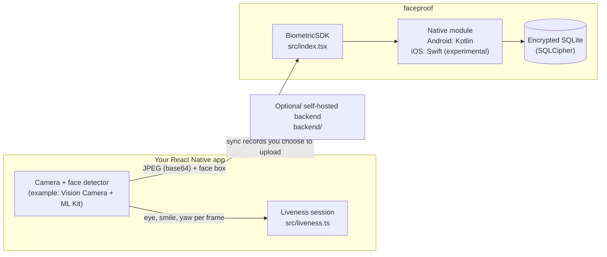
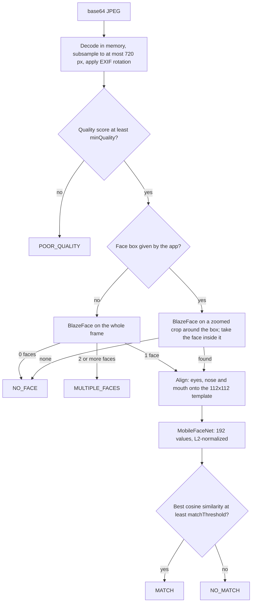

# Architecture

How the SDK is built, what runs where, and why. For the public API, see the
[README](../README.md) and the TSDoc comments in `src/index.tsx`.

## Overview



Everything in the SDK runs on the device. It never makes a network request.
Uploading records is the app's decision, for example with the reference backend.

## JavaScript layer (`src/`)

| File | Responsibility |
|------|----------------|
| `NativeFaceproof.ts` | TurboModule spec. Codegen reads it to generate the native bindings. |
| `index.tsx` | Typed public API (`BiometricSDK`), input checks, clear error if the native module is missing. |
| `liveness.ts` | Liveness session as pure functions. No camera or native dependency, fully unit tested. |
| `random.ts` | Unbiased random integers from a pool of bytes, used to pick challenges. |

React Native's JavaScript engine (Hermes) has no `crypto.getRandomValues`, so
secure random bytes come from the native side: `SecureRandom` on Android and
`SecRandomCopyBytes` on iOS (`BiometricSDK.createSecureRandomInt`).

## Liveness

The liveness check is **active challenge-response only**. It is designed to stop
static photos (printed or on a screen), because a still image cannot change pose
on request; this has not yet been verified on a device. It does **not** defend against video replays, deepfakes or masks. There
is no passive anti-spoofing (texture or depth analysis) yet.

The session lives in JavaScript so it works with any face detector that reports
eye-open and smile probabilities and head yaw. The app feeds one observation per
camera frame into `updateLiveness`.

- Two of three challenges (blink, smile, head turn) in a random order.
- Every challenge must start from the opposite pose, so a still photo cannot pass.
- More than one face in view fails the session immediately.
- Losing the face resets the current challenge.
- The whole session times out (12 seconds by default).

The verification photo is taken after the session passes, while exactly one face
is in view. Liveness and matching are separate steps, so an app can also run
`verifyWorker` without liveness; whether that is acceptable is the app's call.

`checkLiveness(landmarks)` is an older, experimental native blink check for
468-point Face Mesh landmarks. Nothing in the package produces such landmarks.

## Android pipeline



| Class | Responsibility |
|-------|----------------|
| `FaceproofModule` | Bridge entry point. Creates the engines lazily, maps errors to stable codes, closes everything in `invalidate()`. |
| `TFLiteEngine` | Face alignment, MobileFaceNet embedding, quality score. |
| `BlazeFaceDetector` | Runs BlazeFace on a letterboxed 128x128 input; returns boxes and 6 keypoints. |
| `BlazeFaceDecoder` | Anchors, box and keypoint decoding and weighted non-maximum suppression, as in MediaPipe. Pure Kotlin, unit tested. |
| `FaceAligner` | Similarity transform that maps the eyes, nose and mouth onto the template. Pure Kotlin, unit tested. |
| `EmbeddingMath` | Normalization, template averaging, cosine similarity with a size check. |
| `EmbeddingStore` | SQLCipher database: templates and the attendance queue. |
| `KeyVault` | Database passphrase and signing key, wrapped by an Android Keystore key. |
| `AttendanceSignature` | The exact text that is signed for each record. |
| `LivenessEngine` | The experimental landmark blink check. |

**Quality score.** The average of a sharpness score (variance of the Laplacian)
and an exposure score (penalizes very dark or very bright frames), computed on a
256x256 copy. It filters out obviously blurred or badly lit frames; it is not a
face quality model.

**Alignment.** MobileFaceNet was trained on 112x112 crops in which the eyes,
nose and mouth sit at fixed positions. The pipeline rotates, scales and shifts
each face so that its BlazeFace keypoints land on those positions (a
least-squares similarity transform). This matters a great deal: on a subset of
LFW, accuracy went from about 78% with plain box crops to about 99% with
alignment, using the same model (see [BENCHMARKS.md](BENCHMARKS.md)). This is why
BlazeFace runs even when the app passes a face box: the box only selects which
face to use.

**Enrollment** embeds each frame that has exactly one face and stores the
normalized average as the person's template. Enrolling the same ID again
replaces the template.

**Threading.** React Native calls the module on its native-modules background
thread, one call at a time. A lock protects the engines anyway, because
`invalidate()` may run on another thread during a reload.

**Images never touch disk.** Frames are decoded from the base64 string in memory
and recycled after use. The library writes no images and no logs. (Camera
libraries may write their own temporary files; the example app deletes the
photo file right after reading it, see `example/src/photoFile.ts`.)

## Storage

One SQLCipher database, `biometric.db`, in the app's private storage:

```sql
CREATE TABLE embeddings (
  worker_id   TEXT PRIMARY KEY,
  embedding   BLOB,      -- little-endian float32 values
  enrolled_at INTEGER    -- ms since epoch
);
CREATE TABLE attendance_log (
  id         TEXT PRIMARY KEY,  -- random UUID
  worker_id  TEXT,
  timestamp  INTEGER,           -- ms since epoch
  latitude   REAL,              -- NULL when no location was given
  longitude  REAL,
  confidence REAL,
  device_id  TEXT,
  signature  TEXT,              -- base64 HMAC-SHA256
  synced     INTEGER DEFAULT 0
);
```

Keys: see [SECURITY_MODEL.md](SECURITY_MODEL.md). In short, the passphrase and the signing key are random
32-byte secrets, encrypted with a non-exportable Android Keystore key.

## Signed records

Each attendance record is signed with HMAC-SHA256 over this exact text:

```
v1|id|workerId|timestamp|latitude|longitude|confidence|deviceId
```

Latitude and longitude have 7 decimals (empty when absent), confidence has 6,
and the decimal separator is always a dot. Android and iOS build the same text.
The signature shows a record was not changed after it left the SDK, for anyone
who holds the device's key. The reference backend stores it but cannot verify it
yet, because device keys never leave the device.

## Configuration

| Setting | Default | Where |
|---------|---------|-------|
| `matchThreshold` | 0.54 (FAR 1e-4 per comparison on LFW) | `BiometricSDK.initialize({ matchThreshold })` |
| `minQuality` | 0.5 | `BiometricSDK.initialize({ minQuality })`, Android only |
| Liveness timeouts and thresholds | see `DEFAULT_LIVENESS_CONFIG` | `createLivenessState(challenges, config)` |
| Challenges per session | chosen by the app | `pickChallenges(count, randomInt)` |

The match threshold comes from a calibration run with
`ml_prep/calibrate_threshold.py` on the LFW benchmark, which is likely an upper
bound (see [BENCHMARKS.md](BENCHMARKS.md)). Because every verification is
compared with all enrolled people, the chance of a false match grows with the
number enrolled, roughly N x FAR. The quality cutoff and the liveness values were
chosen during development and are not calibrated.

## Error codes

Promise rejections carry a stable `code`:

| Code | Meaning |
|------|---------|
| `MODEL_NOT_FOUND` | A model file is missing. Run `yarn setup:models` and rebuild. |
| `INVALID_ARGUMENT` | Bad ID, location or option value. |
| `NO_FACE` | Enrollment found no usable single face in any frame. |
| `KEYSTORE_ERROR` | Stored keys cannot be read on this device (for example after a backup restore). |
| `NOT_INITIALIZED` | iOS: call `initialize()` first. |
| `ENCRYPTION_UNAVAILABLE` | iOS: SQLCipher is not linked, so nothing is stored. |
| `OUT_OF_MEMORY` | The image was too large to process. |
| `NATIVE_ERROR` | Anything unexpected; the message has details. |

## Platform support

| Feature | Android | iOS |
|---------|---------|-----|
| Status | Supported | Experimental: compiles in CI, not tested on a device |
| Face detection without a box | BlazeFace | Not available; pass a face box |
| Face alignment | Yes (BlazeFace keypoints) | No: plain box crop, so accuracy will be much lower |
| Embedding model | Bundled TFLite MobileFaceNet | Core ML model not provided yet |
| Quality gate | Yes | No |
| Encrypted storage | SQLCipher | SQLCipher, checked at startup |
| Secure random | Yes | Yes |

## Sync backend (optional)

`backend/` is a reference AWS SAM stack you deploy into your own AWS account: an
HTTP API protected by a bearer token, a Lambda function that writes records to
DynamoDB idempotently, and a 90-day expiry on stored records. See
[backend/README.md](../backend/README.md).
